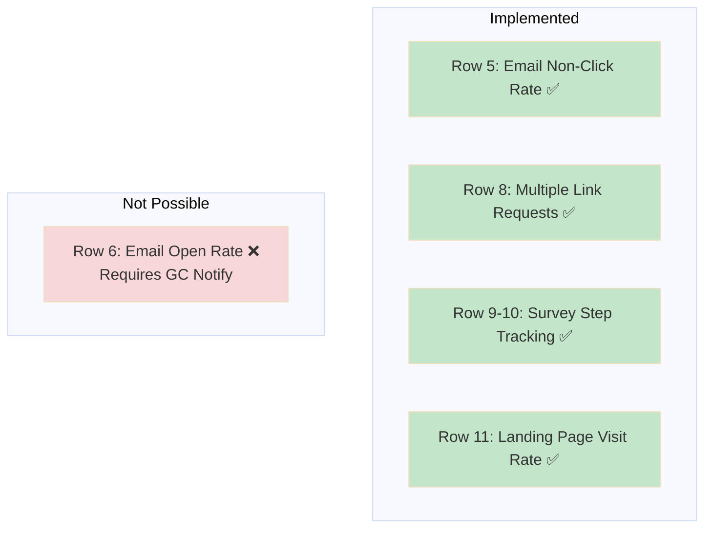
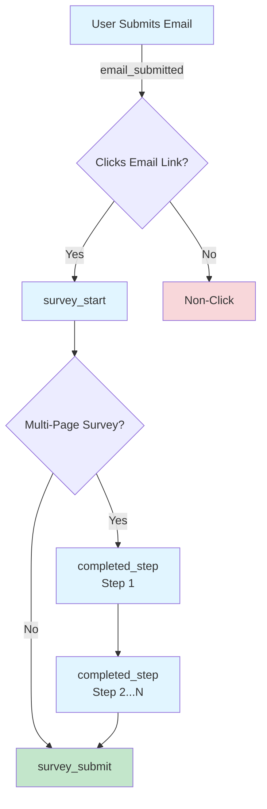
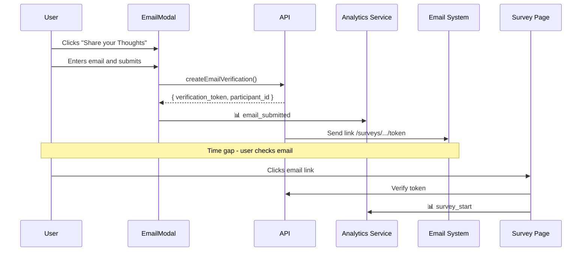
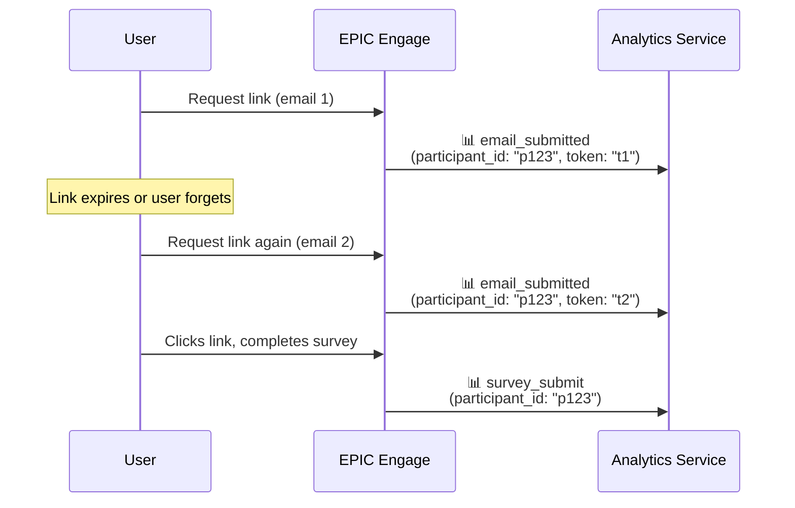
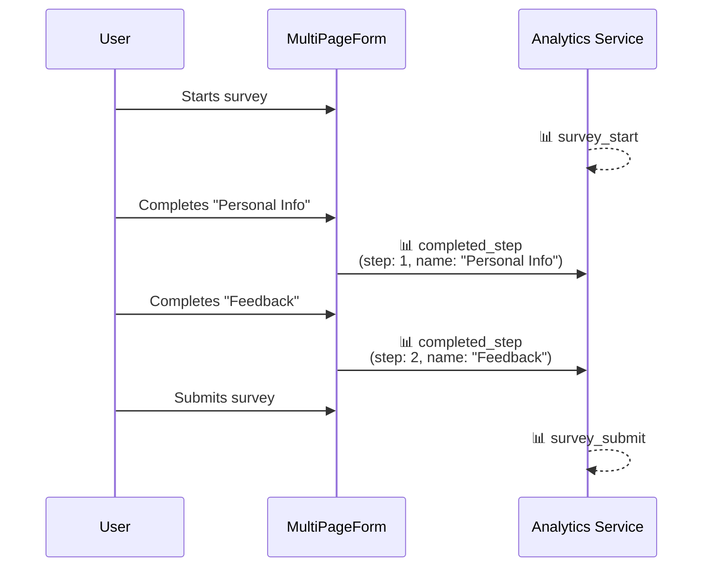
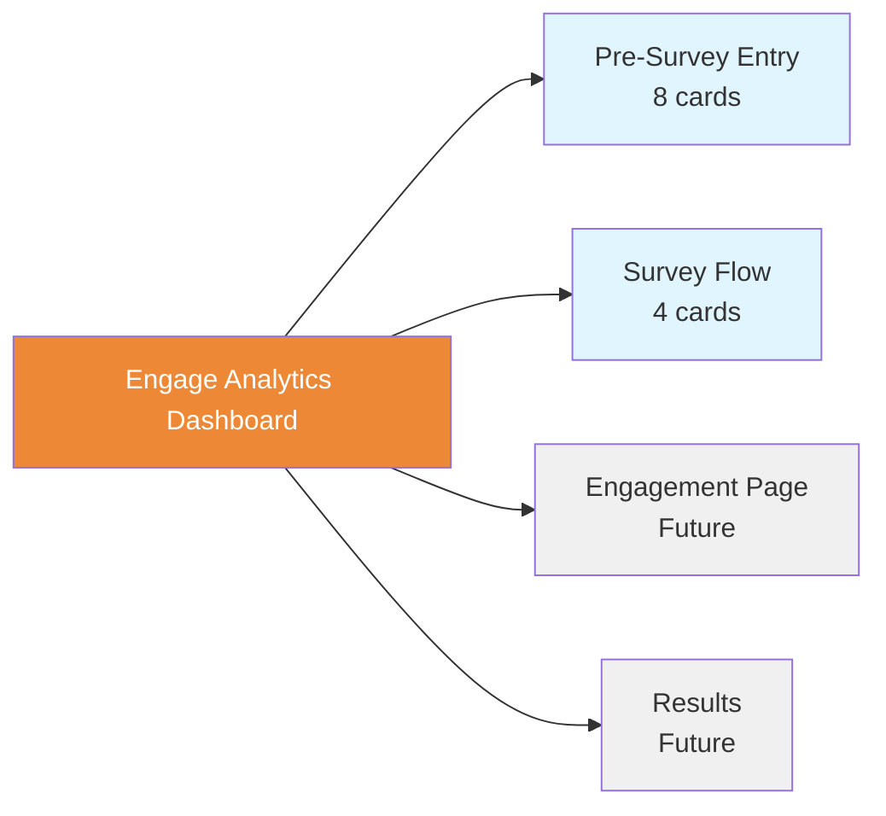
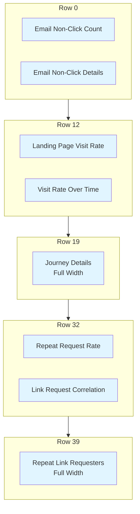
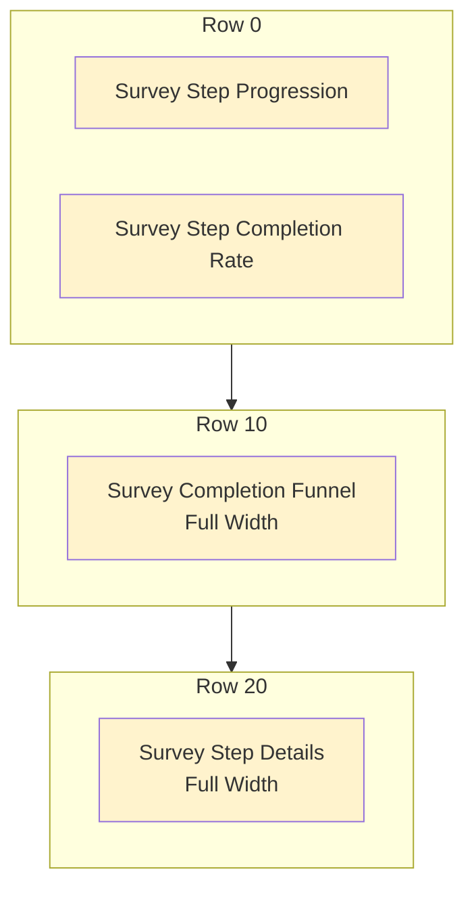
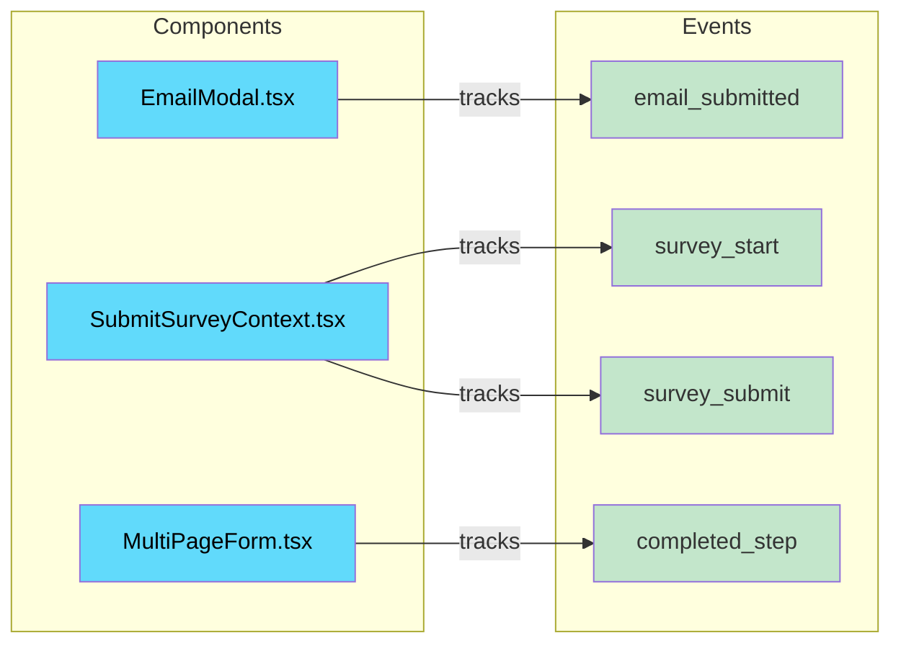

# EPIC Engage Analytics Metrics

Implemented analytics metrics for EPIC Engage, tracking the complete user journey from email submission through survey completion.

---

## CSV Implementation Status



| Row | Metric | Status | Section |
|-----|--------|--------|---------|
| 5 | Email non-click rate | ✅ Implemented | [Email Non-Click Rate](#email-non-click-rate) |
| 6 | Email open rate | ❌ Not Possible | [Email Open Rate](#email-open-rate) |
| 8 | Multiple link request correlation | ✅ Implemented | [Multiple Link Request Correlation](#multiple-link-request-correlation) |
| 9 | Track which step users drop off | ✅ Implemented | [Survey Step Progression](#survey-step-progression) |
| 10 | Track completion rate per step | ✅ Implemented | [Survey Step Progression](#survey-step-progression) |
| 11 | Landing page visit rate | ✅ Implemented | [Landing Page Visit Rate](#landing-page-visit-rate) |

---

## Events Summary

All analytics events tracked by EPIC Engage:

| Event | Trigger | File | Key Properties |
|-------|---------|------|----------------|
| `email_submitted` | Email submitted in modal | `EmailModal.tsx` | `verification_token`, `participant_id` |
| `survey_start` | Survey page loaded from email link | `SubmitSurveyContext.tsx` | `verification_token`, `participant_id` |
| `completed_step` | User completes a survey step | `MultiPageForm.tsx` | `step_number`, `step_name`, `step_count` |
| `survey_submit` | Survey successfully submitted | `SubmitSurveyContext.tsx` | `verification_token`, `participant_id` |

**Correlation Keys:**
- `verification_token` - Links email submission to survey landing (single journey)
- `participant_id` - Identifies repeat users across multiple link requests

**Event Flow:**



---

## Pre-Survey Entry

### Landing Page Visit Rate

> **CSV Row 11** - Landing page visit rate

Tracks email submission through to survey landing page visit.



**Metabase Cards:**
- Landing Page Visit Rate (smartscalar) - Conversion percentage
- Landing Page Visit Rate - Over Time (line) - Daily trend
- Landing Page Visit Rate - Journey Details (table) - Individual journeys, exportable

---

### Email Non-Click Rate

> **CSV Row 5** - Email non-click rate

Tracks email submissions that did not result in survey landing page visits. Useful for identifying potential email delivery issues or user engagement barriers.

**Metabase Cards:**
- Email Non-Click Count (scalar) - Total non-conversions
- Email Non-Click Details (table) - Individual non-converted emails with timestamps

**Query:**
```sql
SELECT 
  properties->>'verification_token' as token,
  MIN(timestamp) as email_submitted_at,
  EXTRACT(EPOCH FROM (NOW() - MIN(timestamp))) / 3600 as hours_since_email
FROM events
WHERE event_type IN ('email_submitted', 'survey_start')
  AND properties->>'verification_token' IS NOT NULL
GROUP BY properties->>'verification_token'
HAVING COUNT(CASE WHEN event_type = 'survey_start' THEN 1 END) = 0
ORDER BY email_submitted_at DESC;
```

---

### Email Open Rate

> **CSV Row 6** - Email open rate

> **⚠️ NOT POSSIBLE** - Email open rate tracking requires a tracking pixel embedded in emails by GC Notify. This is outside the scope of the analytics platform and would require changes to the BC Gov email service. Contact the GC Notify team to request open tracking if this metric is needed.

---

### Multiple Link Request Correlation

> **CSV Row 8** - Track correlation between users requesting the link multiple times and completing the survey

Tracks users who request survey links multiple times using `participant_id`. Helps identify users facing barriers to survey completion.



**Metabase Cards:**
- Repeat Link Requesters (table) - Users with >1 link request, completion status
- Repeat Request Completion Rate (scalar) - % of repeat requesters who completed
- Link Request vs Completion Correlation (bar) - Completion rate by # of requests

**Query:**
```sql
SELECT 
  properties->>'participant_id' as participant_id,
  COUNT(DISTINCT CASE WHEN event_type = 'email_submitted' 
        THEN properties->>'verification_token' END) as link_requests,
  BOOL_OR(event_type = 'survey_submit') as completed_survey
FROM events
WHERE event_type IN ('email_submitted', 'survey_submit')
  AND properties->>'participant_id' IS NOT NULL
GROUP BY properties->>'participant_id'
HAVING COUNT(DISTINCT CASE WHEN event_type = 'email_submitted' 
              THEN properties->>'verification_token' END) > 1
ORDER BY link_requests DESC;
```

---

## Survey Flow

### Survey Step Progression

> **CSV Rows 9-10** - Track which step users are dropping off / Track completion rate per step

Tracks user progression through multi-page survey steps. Identifies where users drop off.



**Event Properties:**

| Property | Description | Example |
|----------|-------------|---------|
| `step_number` | Current step (1-indexed) | `1` |
| `step_count` | Total steps in survey | `3` |
| `step_name` | Step title from form config | `"Personal Info"` |
| `survey_id` | Survey identifier | `"42"` |
| `engagement_id` | Engagement identifier | `"15"` |

**Metabase Cards:**
- Survey Step Progression (funnel) - Users at each step
- Survey Step Completion Rate (bar) - Retention % per step
- Survey Step Details (table) - Breakdown by survey
- Survey Completion Funnel (bar) - Full funnel: start → steps → submit

**Query:**
```sql
WITH funnel AS (
  SELECT 0 as stage, 'Survey Start' as stage_name,
         COUNT(DISTINCT session_id) as users
  FROM events WHERE event_type = 'survey_start'
  
  UNION ALL
  
  SELECT CAST(properties->>'step_number' AS INTEGER),
         properties->>'step_name',
         COUNT(DISTINCT session_id)
  FROM events WHERE event_type = 'completed_step'
  GROUP BY 1, 2
  
  UNION ALL
  
  SELECT 99, 'Survey Submit', COUNT(DISTINCT session_id)
  FROM events WHERE event_type = 'survey_submit'
)
SELECT * FROM funnel ORDER BY stage;
```

---

## Metabase Dashboard

**Dashboard:** Engage Analytics

### Tabs



| Tab | Cards | Purpose |
|-----|-------|---------|
| Pre-Survey Entry | 8 | Email-to-survey conversion, non-clicks, repeat users |
| Survey Flow | 4 | Step progression, completion funnel |
| Engagement Page | - | (Future) |
| Results | - | (Future) |

### Card Layout

**Pre-Survey Entry Tab:**



| Row | Cards |
|-----|-------|
| 0 | Email Non-Click Count, Email Non-Click Details |
| 12 | Landing Page Visit Rate, Visit Rate Over Time |
| 19 | Journey Details (full width) |
| 32 | Repeat Request Completion Rate, Link Request Correlation |
| 39 | Repeat Link Requesters (full width) |

**Survey Flow Tab:**



| Row | Cards |
|-----|-------|
| 0 | Survey Step Progression, Survey Step Completion Rate |
| 10 | Survey Completion Funnel (full width) |
| 20 | Survey Step Details (full width) |

### Deployment

Dashboard cards are configured via YAML and deployed using the `setup-metabase-app.sh` script. Contact the analytics platform team for deployment instructions.

---

## Implementation Files



| File | Events | Purpose |
|------|--------|---------|
| `met-web/src/components/public/engagement/view/EmailModal.tsx` | `email_submitted` | Email submission modal |
| `met-web/src/components/public/survey/submit/SubmitSurveyContext.tsx` | `survey_start`, `survey_submit` | Survey context and submission |
| `met-web/src/components/shared/form/FormBuilder/MultiPageForm.tsx` | `completed_step` | Multi-page form navigation |

---

## Related Documentation

- [Analytics Integration Guide](Penguin_Analytics_Integration.md) - Setup and configuration

