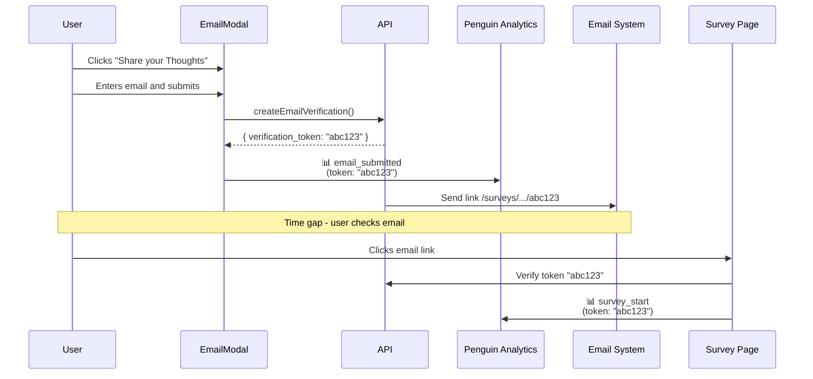

# EPIC Engage Analytics Metrics

Implemented analytics metrics for EPIC Engage.

---

## Pre-Survey Entry

### Landing Page Visit Rate

Tracks email submission through to survey landing page visit.

**Journey:**



**Events:**

| Event | Trigger | File | Properties |
|-------|---------|------|------------|
| `email_submitted` | Email submitted in modal | `EmailModal.tsx` | `engagement_id`, `survey_id`, `verification_token` |
| `survey_start` | Survey page loaded from email link | `SubmitSurveyContext.tsx` | `engagement_id`, `survey_id`, `verification_token` |

**Correlation:** `verification_token` links both events.

**Queries:**

*Conversion rate by engagement:*
```sql
SELECT 
    properties->>'engagement_id' as engagement_id,
    COUNT(DISTINCT CASE WHEN event_type = 'email_submitted' 
          THEN properties->>'verification_token' END) as emails_submitted,
    COUNT(DISTINCT CASE WHEN event_type = 'survey_start' 
          THEN properties->>'verification_token' END) as survey_landings,
    ROUND(100.0 * 
        COUNT(DISTINCT CASE WHEN event_type = 'survey_start' 
              THEN properties->>'verification_token' END)::numeric /
        NULLIF(COUNT(DISTINCT CASE WHEN event_type = 'email_submitted' 
              THEN properties->>'verification_token' END), 0)
    , 1) as visit_rate_pct
FROM events
WHERE event_type IN ('email_submitted', 'survey_start')
  AND properties->>'verification_token' IS NOT NULL
GROUP BY properties->>'engagement_id';
```

*Individual journeys:*
```sql
SELECT 
    properties->>'verification_token' as token,
    properties->>'engagement_id' as engagement_id,
    MIN(timestamp) FILTER (WHERE event_type = 'email_submitted') as email_sent_at,
    MIN(timestamp) FILTER (WHERE event_type = 'survey_start') as landed_at,
    CASE 
        WHEN MIN(timestamp) FILTER (WHERE event_type = 'survey_start') IS NOT NULL 
        THEN 'Converted' 
        ELSE 'Did not click' 
    END as status
FROM events
WHERE event_type IN ('email_submitted', 'survey_start')
  AND properties->>'verification_token' IS NOT NULL
GROUP BY properties->>'verification_token', properties->>'engagement_id'
ORDER BY email_sent_at DESC;
```

---

## Metabase Dashboard

**Dashboard:** Engage Analytics  
**Tab:** Pre-Survey Entry  
**Config:** `penguin-analytics/scripts/configs/met-web.yaml`

**Visualizations:**
- Visit Rate (smartscalar) - Conversion percentage with week-over-week trend
- Emails Submitted (smartscalar) - Total email submissions
- Survey Landings (smartscalar) - Total survey visits from emails
- Visit Rate Trend (line chart) - Daily conversion rate over time
- Journey Details (table) - Individual journeys with timestamps, exportable to CSV/Excel

**Deployment:**
```bash
cd penguin-analytics
./scripts/setup-metabase-app.sh \
  --config scripts/configs/met-web.yaml \
  --url $METABASE_URL \
  --email $METABASE_EMAIL \
  --password $METABASE_PASSWORD
```

---

## Related Documentation

- [Penguin Analytics Integration](Penguin_Analytics_Integration.md) - Setup and all available events

