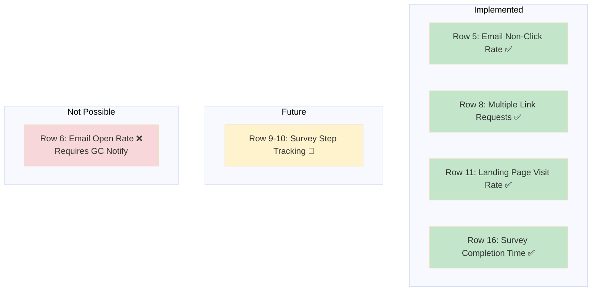
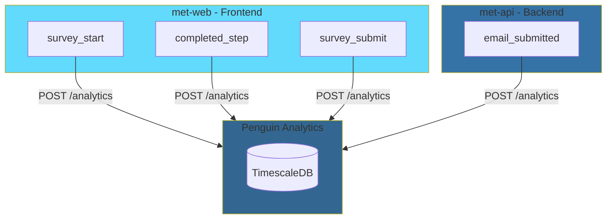
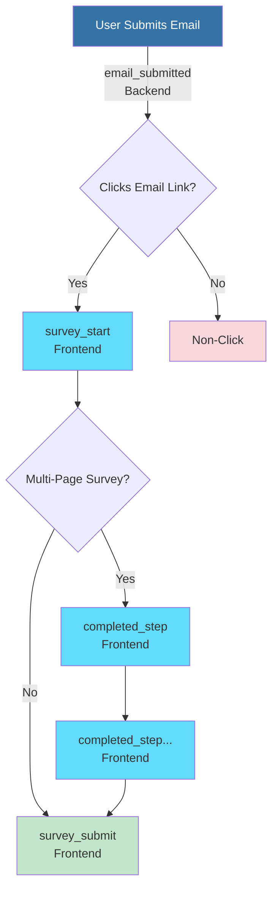
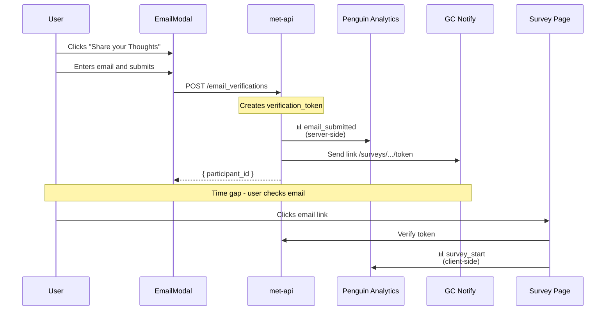
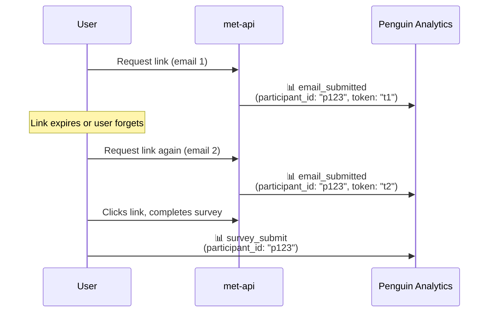
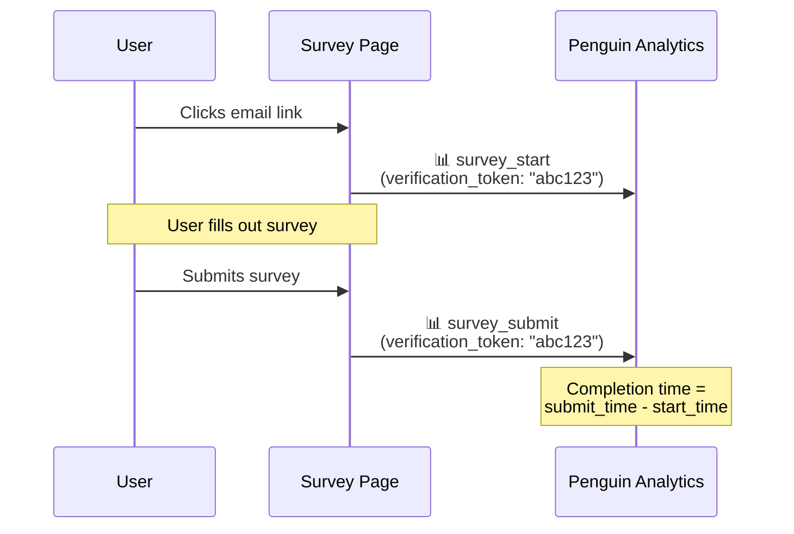
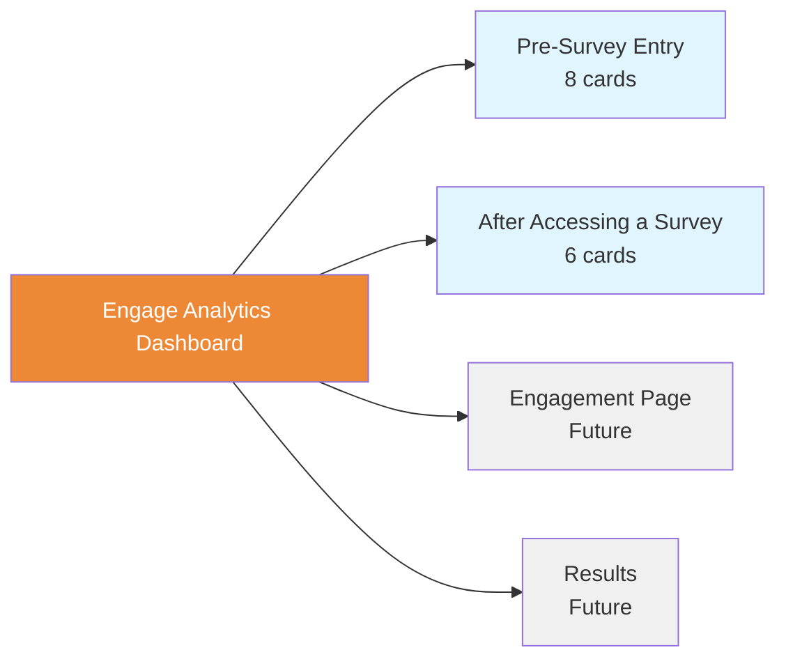
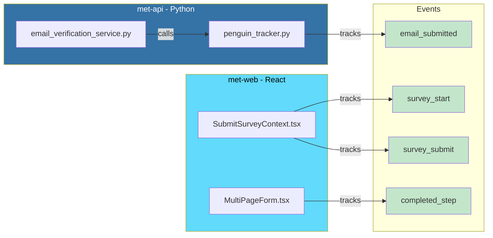

# Penguin Analytics Events

Analytics events tracked by EPIC Engage for the complete user journey from email submission through survey completion. Events are sent to Penguin Analytics using a hybrid architecture (backend + frontend).

---

## Implementation Status



| Row | Metric | Status | Section |
|-----|--------|--------|---------|
| 5 | Email non-click rate | ✅ Implemented | [Email Non-Click Rate](#email-non-click-rate) |
| 6 | Email open rate | ❌ Not Possible | [Email Open Rate](#email-open-rate) |
| 8 | Multiple link request correlation | ✅ Implemented | [Multiple Link Request Correlation](#multiple-link-request-correlation) |
| 9 | Track which step users drop off | 🔄 Future | [Survey Step Progression](#survey-step-progression) |
| 10 | Track completion rate per step | 🔄 Future | [Survey Step Progression](#survey-step-progression) |
| 11 | Landing page visit rate | ✅ Implemented | [Landing Page Visit Rate](#landing-page-visit-rate) |
| 16 | Survey completion time | ✅ Implemented | [Survey Completion Time](#survey-completion-time) |

---

## Hybrid Architecture

Events are tracked from both frontend (met-web) and backend (met-api) to capture the complete user journey:



**Why Hybrid?**
- `email_submitted` is tracked **server-side** because it requires access to `verification_token` which is not returned to the frontend for security reasons
- Survey events are tracked **client-side** for real-time user interaction data and browser context

**Session Continuity:**
- Frontend passes `X-Analytics-Session-Id` header on all API requests
- Backend extracts this header to maintain session continuity across events
- All events for a user journey share the same `session_id`

---

## Events Summary

| Event | Location | Trigger | Key Properties |
|-------|----------|---------|----------------|
| `email_submitted` | **Backend** | Email verification created | `verification_token`, `participant_id`, `survey_id`, `engagement_id` |
| `survey_start` | Frontend | Survey page loaded from email link | `verification_token`, `participant_id`, `survey_id`, `engagement_id` |
| `completed_step` | Frontend | User completes a survey step | `step_number`, `step_name`, `step_count`, `survey_id`, `engagement_id` |
| `survey_submit` | Frontend | Survey successfully submitted | `verification_token`, `participant_id`, `survey_id`, `engagement_id` |

**Correlation Keys:**
- `verification_token` - Links email submission to survey landing (single journey)
- `participant_id` - Identifies repeat users across multiple link requests
- `session_id` - Groups all events in a browser session

**Event Flow:**



---

## Pre-Survey Entry

### Landing Page Visit Rate

> **CSV Row 11** - Landing page visit rate

Tracks email submission through to survey landing page visit.



**Metabase Cards:**
- Landing Page Visit Rate (smartscalar) - Conversion percentage
- Landing Page Visit Rate - Over Time (line) - Daily trend
- Landing Page Visit Rate - Journey Details (table) - Individual journeys, exportable

---

### Email Non-Click Rate

> **CSV Row 5** - Email non-click rate

Tracks email submissions that did not result in survey landing page visits. Useful for identifying potential email delivery issues or user engagement barriers.

**Metabase Cards:**
- Email Non-Click Count (scalar) - Total non-conversions
- Email Non-Click Details (table) - Individual non-converted emails with timestamps

**Query:**
```sql
SELECT 
  properties->>'verification_token' as token,
  MIN(timestamp) as email_submitted_at,
  EXTRACT(EPOCH FROM (NOW() - MIN(timestamp))) / 3600 as hours_since_email
FROM events
WHERE event_type IN ('email_submitted', 'survey_start')
  AND properties->>'verification_token' IS NOT NULL
GROUP BY properties->>'verification_token'
HAVING COUNT(CASE WHEN event_type = 'survey_start' THEN 1 END) = 0
ORDER BY email_submitted_at DESC;
```

---

### Email Open Rate

> **CSV Row 6** - Email open rate

> **⚠️ NOT POSSIBLE** - Email open rate tracking requires a tracking pixel embedded in emails by GC Notify. This is outside the scope of the analytics platform and would require changes to the BC Gov email service. Contact the GC Notify team to request open tracking if this metric is needed.

---

### Multiple Link Request Correlation

> **CSV Row 8** - Track correlation between users requesting the link multiple times and completing the survey

Tracks users who request survey links multiple times using `participant_id`. Helps identify users facing barriers to survey completion.



**Metabase Cards:**
- Repeat Link Requesters (table) - Users with >1 link request, completion status
- Repeat Request Completion Rate (scalar) - % of repeat requesters who completed
- Link Request vs Completion Correlation (bar) - Completion rate by # of requests

**Query:**
```sql
SELECT 
  properties->>'participant_id' as participant_id,
  COUNT(DISTINCT CASE WHEN event_type = 'email_submitted' 
        THEN properties->>'verification_token' END) as link_requests,
  BOOL_OR(event_type = 'survey_submit') as completed_survey
FROM events
WHERE event_type IN ('email_submitted', 'survey_submit')
  AND properties->>'participant_id' IS NOT NULL
GROUP BY properties->>'participant_id'
HAVING COUNT(DISTINCT CASE WHEN event_type = 'email_submitted' 
              THEN properties->>'verification_token' END) > 1
ORDER BY link_requests DESC;
```

---

## After Accessing a Survey

### Survey Completion Time

> **CSV Row 16** - Track the average duration between first survey page load and final submission event

Tracks how long users take to complete surveys, from `survey_start` to `survey_submit`. Uses `verification_token` to correlate start and submit events.



**Metabase Cards:**
- Survey Completion Time (smartscalar) - Average completion time with trend
- Completed Surveys (scalar) - Total count of completed surveys
- Survey Completion Time - Over Time (line) - Daily average completion time trend
- Completed Surveys - Over Time (line) - Daily completion count trend
- Survey Completion Time - Distribution (bar) - Time buckets (0-5, 5-15, 15-30, 30+ min)
- Survey Completion Time - Details (table) - Individual completions with timestamps

**Query:**
```sql
WITH submit_events AS (
  SELECT 
    properties->>'verification_token' as token,
    MIN(timestamp) as submitted_at
  FROM events
  WHERE event_type = 'survey_submit'
    AND properties->>'verification_token' IS NOT NULL
  GROUP BY properties->>'verification_token'
),
start_events AS (
  SELECT 
    properties->>'verification_token' as token,
    MIN(timestamp) as started_at
  FROM events
  WHERE event_type = 'survey_start'
    AND properties->>'verification_token' IS NOT NULL
  GROUP BY properties->>'verification_token'
)
SELECT 
  s.token,
  st.started_at,
  s.submitted_at,
  ROUND(EXTRACT(EPOCH FROM (s.submitted_at - st.started_at)) / 60, 1) as completion_minutes
FROM submit_events s
JOIN start_events st ON s.token = st.token
ORDER BY s.submitted_at DESC;
```

---

### Survey Step Progression (Future)

> **CSV Rows 9-10** - Track which step users drop off / Track completion rate per step

🔄 **Planned for future implementation.** Will track user progression through multi-page survey steps using `completed_step` events.

**Available Data:**
The `completed_step` event captures:
- `step_number` - Current step (1-indexed)
- `step_count` - Total steps in survey
- `step_name` - Page title from form definition
- `survey_id`, `engagement_id`

---

## Metabase Dashboard

**Dashboard:** Engage Analytics

### Tabs



| Tab | Cards | Purpose |
|-----|-------|---------|
| Pre-Survey Entry | 8 | Email-to-survey conversion, non-clicks, repeat users |
| After Accessing a Survey | 6 | Survey completion time and count metrics |
| Engagement Page | - | (Future) |
| Results | - | (Future) |

### Deployment

Dashboard cards are configured via YAML and deployed using the `setup-metabase-app.sh` script. Contact the analytics platform team for deployment instructions.

---

## Implementation Files



### Backend (met-api)

| File | Purpose |
|------|---------|
| `src/met_api/services/email_verification_service.py` | Calls `track_email_verification()` after sending email |
| `src/met_api/utils/penguin_tracker.py` | PenguinTracker provider - sends events to Penguin Analytics API |
| `src/met_api/utils/analytics.py` | Initializes analytics providers (Snowplow + Penguin) |
| `src/met_api/config.py` | Configuration: `PENGUIN_ANALYTICS_ENABLED`, `PENGUIN_ANALYTICS_URL` |

### Frontend (met-web)

| File | Events | Purpose |
|------|--------|---------|
| `src/components/public/survey/submit/SubmitSurveyContext.tsx` | `survey_start`, `survey_submit` | Survey context and submission |
| `src/components/shared/form/FormBuilder/MultiPageForm.tsx` | `completed_step` | Multi-page form navigation |
| `src/apiManager/httpRequestHandler/index.ts` | - | Sends `X-Analytics-Session-Id` header |
| `src/services/analytics/analyticsService.ts` | - | Analytics service with Penguin plugin |

---

## Configuration

### Backend Environment Variables

```bash
# Enable Penguin Analytics tracking
PENGUIN_ANALYTICS_ENABLED=true

# Penguin Analytics API endpoint
PENGUIN_ANALYTICS_URL=https://penguin-analytics-api-c72cba-dev.apps.gold.devops.gov.bc.ca/analytics

# Source app identifier for events
PENGUIN_ANALYTICS_SOURCE_APP=met-api
```

### Frontend Configuration

The frontend uses `analytics.js` with the `penguinAnalyticsPlugin`. Session ID is stored in `sessionStorage` as `penguin_session_id` and passed to the backend via the `X-Analytics-Session-Id` header.

---

## Related Documentation

- [Analytics Integration Guide](Penguin_Analytics_Integration.md) - Setup and configuration guide
