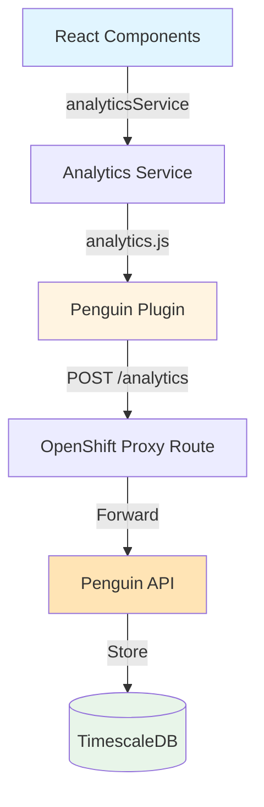
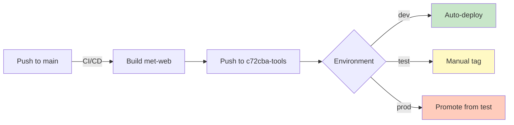

# Penguin Analytics Integration

Event tracking for EPIC Engage using analytics.js with a custom plugin. Uses path-based proxy routes (`/analytics`) to bypass ad blockers.

## Architecture



**Files:**
- `analytics.ts` - Service wrapper with feature flag
- `penguinPlugin.ts` - Custom analytics.js plugin (session management, auto-context)
- `types.ts` - TypeScript interfaces (11 action types)
- `PageViewTracker.tsx` - Auto-tracks page navigation

## Event Model

```typescript
analyticsService.track({
  action: 'survey_start',        // required - one of 11 types
  survey_id?: string,
  engagement_id?: string,
  step_number?: number,          // 1-indexed
  text?: string,                 // contextual info
  // ... other optional fields
});
```

**Actions:** `page_view`, `survey_start`, `completed_step`, `survey_submit`, `video_play`, `document_open`, `link_click`, `subscription_click`, `map_click`, `cta_click`, `error`

## Usage

```typescript
import { analyticsService } from 'services/penguinAnalytics';

// Page views (auto-tracked by PageViewTracker)
analyticsService.page('Engagement Page', 'eng-456');

// Survey flow
analyticsService.track({ action: 'survey_start', survey_id: '82124', engagement_id: 'eng-456' });
analyticsService.track({ action: 'completed_step', survey_id: '82124', step_number: 1 });
analyticsService.track({ action: 'survey_submit', survey_id: '82124' });

// Widget interactions
analyticsService.track({ action: 'video_play', engagement_id: 'eng-456', text: 'Overview' });
analyticsService.track({ action: 'cta_click', engagement_id: 'eng-456', text: 'Share Thoughts' });

// User identification
analyticsService.identify(userId);  // After login
analyticsService.reset();           // On logout
```

## Configuration

**Environment Variables:**
```bash
REACT_APP_PENGUIN_URL=/analytics        # Proxy route path
REACT_APP_PENGUIN_ENABLED=true          # Feature flag
```

**OpenShift ConfigMap** (`openshift/web.dc.yml`):
```yaml
window["_env_"] = {
  "REACT_APP_PENGUIN_URL": "/analytics",
  "REACT_APP_PENGUIN_ENABLED": "${PENGUIN_ENABLED}",
}
```

**Feature Flag Logic:**
```typescript
if (!AppConfig.penguinEnabled) return;  // No-op if disabled
```

**Deployment:** Set `PENGUIN_ENABLED=true` in all environments (dev/test/prod)

## Metrics Coverage

| Metric | Action(s) | Backend Analysis |
|--------|-----------|------------------|
| Survey completion time | `survey_start` → `survey_submit` | Timestamp diff |
| Survey abandonment rate | Count ratio | `survey_start` vs `survey_submit` |
| Step-level drop-off | `completed_step` | Last completed step |
| Widget interactions | `video_play`, `document_open`, `map_click` | Event counts |
| CTA effectiveness | `cta_click` | Click-through rate |
| Link tracking | `link_click` | URL analysis |
| Page analytics | `page_view` | Time-on-page, referrers |
| Geo-location | All events | Server-side IP enrichment |

**Coverage:** 85% of `engage_analytics_tracker.csv` requirements

## Auto-Captured Context

- **Session ID**: `crypto.randomUUID()` stored in `sessionStorage` (per-tab)
- **Browser**: URL, referrer, user agent, viewport/screen dimensions
- **Device**: Mobile detection, touch points, pixel ratio, color depth
- **Network**: Connection type, downlink, RTT
- **Locale**: Timezone, language preferences, platform

## Testing

```bash
yarn test tests/unit/services/penguinAnalytics.test.ts  # 21 tests
```

**Coverage:** Feature flag, all 11 actions, session management, complete survey flow

## Deployment



**Workflow:** `.github/workflows/met-web-cd.yml`

**Proxy Routes:** Already deployed to c72cba (dev/test/prod) via penguin-analytics Helm charts

## Troubleshooting

| Issue | Check | Expected |
|-------|-------|----------|
| No events sent | `window._env_.REACT_APP_PENGUIN_ENABLED` | `"true"` |
| Network errors | DevTools → Network → `/analytics` | 201 Created |
| Proxy route | `curl https://engage.eao.gov.bc.ca/analytics/health` | `{"status":"healthy"}` |
| Session ID | `sessionStorage.getItem('penguin_session_id')` | UUID string |

**Note:** Sessions are per-tab (by design). New tab = new session ID.

## Privacy

- **Sessions**: Anonymous UUIDs (no cross-device tracking)
- **User IDs**: Only captured after Keycloak authentication
- **Participant IDs**: Optional field (requires privacy approval)
- **IP Addresses**: Client IP hashed (4-byte prefix), not stored in raw form
- **Data Retention**: Configured in TimescaleDB (time-series partitioning)
