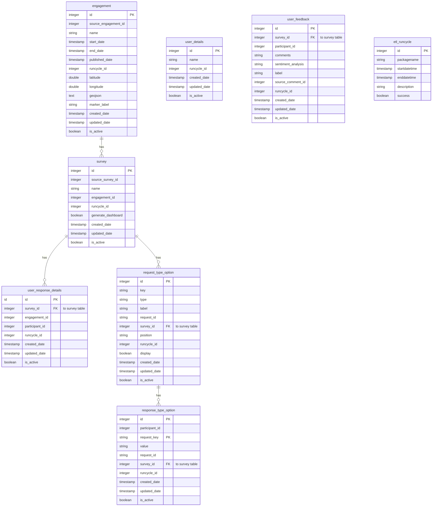

# Analytics API Database ERD

> **⚠️ Legacy System:** This documents the **analytics-api data warehouse** schema used for Redash survey response dashboards.
> 
> For **Penguin Analytics** (user journey event tracking), see [docs/analytics/](analytics/README.md).

---

## Database Schema

This is the ETL data warehouse that stores aggregated survey response data. Data is extracted from the main MET database via scheduled ETL jobs.

## Related

- [analytics-api/](../analytics-api/) - Python Flask API for this database
- [Redash Queries](Redash_Queries.md) - SQL queries used in Redash dashboards
- [Redash Changes](Redash_Changes.md) - BC Gov customizations to Redash fork
