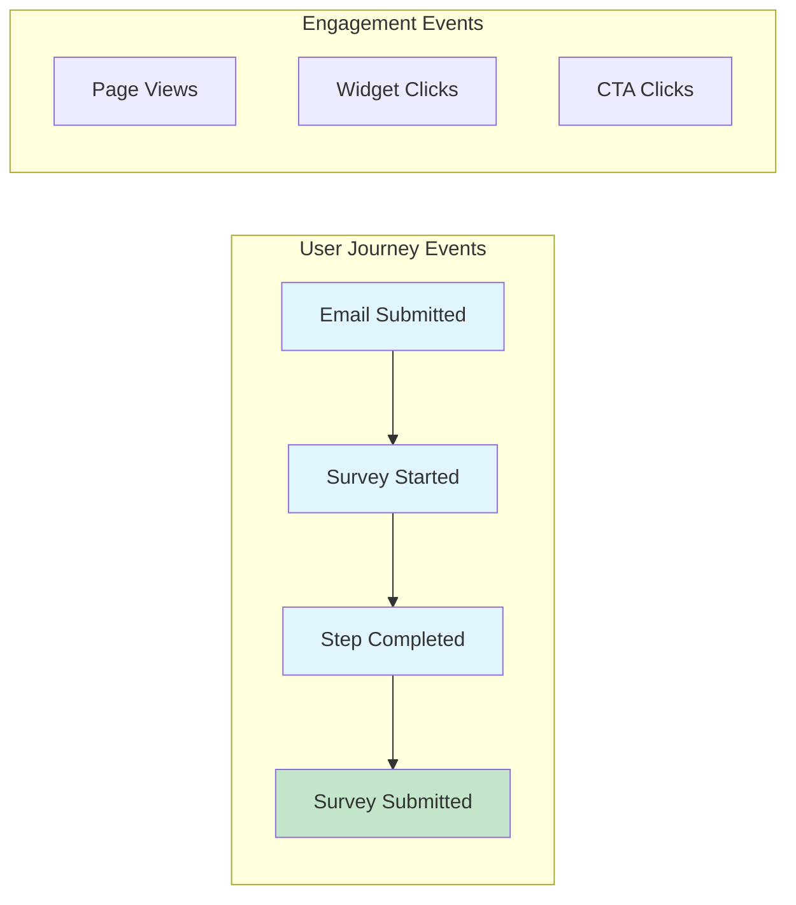
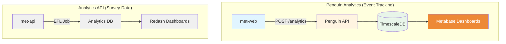

# EPIC Engage Analytics

Real-time event tracking for user journey analytics using Penguin Analytics platform.

## What This Tracks

Penguin Analytics captures **user behavior events** throughout the engagement and survey experience:

| Event Type | Purpose |
|------------|---------|
| `email_submitted` | User enters email to request survey link |
| `survey_start` | User clicks email link, lands on survey |
| `completed_step` | User completes a survey page/step |
| `survey_submit` | User submits completed survey |
| `page_view` | User views engagement or survey page |
| Widget events | Document opens, video plays, map clicks, etc. |

## How It Differs from Analytics API

EPIC Engage has **two separate analytics systems**:

| System | Purpose | Data |
|--------|---------|------|
| **Penguin Analytics** (this) | User journey tracking | Events, sessions, drop-off analysis |
| **Analytics API** | Survey response warehouse | Aggregated survey answers for Redash |

## Documentation

| Document | Description |
|----------|-------------|
| [Integration Guide](integration-guide.md) | Setup, configuration, usage examples |
| [Metrics Reference](metrics-reference.md) | Event details, queries, dashboard layout |
| [Database Schema](database-schema.md) | SQL guide for business analysts |

## Current Status (March 2026)

| Environment | Status |
|-------------|--------|
| Dev | ✅ Active |
| Test | ✅ Active |
| Prod | ✅ Active |

All environments have Penguin Analytics enabled via ConfigMap (`REACT_APP_PENGUIN_ENABLED=true`).
