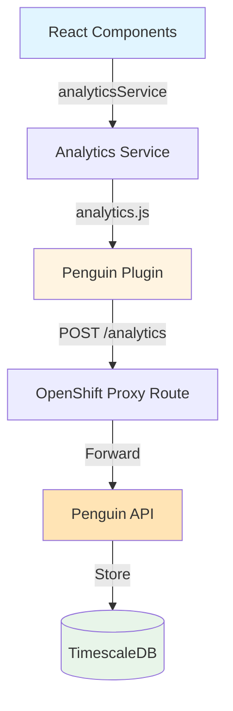

# Penguin Analytics Integration Guide

Event tracking for EPIC Engage using analytics.js with a custom plugin. Uses path-based proxy routes (`/analytics`) to bypass ad blockers.

## Architecture



**Implementation Files:**

| File | Purpose |
|------|---------|
| `met-web/src/services/penguinAnalytics/analytics.ts` | Service wrapper with feature flag |
| `met-web/src/services/penguinAnalytics/penguinPlugin.ts` | Custom analytics.js plugin |
| `met-web/src/services/penguinAnalytics/types.ts` | TypeScript interfaces (11 action types) |
| `met-web/src/components/common/PageViewTracker.tsx` | Auto-tracks page navigation |

---

## Event Model

```typescript
analyticsService.track({
  action: 'survey_start',        // required - one of 11 types
  survey_id?: string,
  engagement_id?: string,
  step_number?: number,          // 1-indexed
  text?: string,                 // contextual info
  // ... other optional fields
});
```

**Available Actions:**

| Action | Trigger |
|--------|---------|
| `page_view` | Page navigation (auto-tracked) |
| `email_submitted` | User submits email in modal |
| `survey_start` | User lands on survey from email link |
| `completed_step` | User completes a survey step |
| `survey_submit` | User submits completed survey |
| `video_play` | Video widget play |
| `document_open` | Document widget open |
| `link_click` | Link clicked within survey |
| `subscription_click` | Sign-up widget click |
| `map_click` | Map widget interaction |
| `cta_click` | Call-to-action button click |
| `error` | Application error |

---

## Usage Examples

```typescript
import { analyticsService } from 'services/penguinAnalytics';

// Page views (auto-tracked by PageViewTracker)
analyticsService.page('Engagement Page', 'eng-456');

// Survey flow
analyticsService.track({ action: 'survey_start', survey_id: '82124', engagement_id: 'eng-456' });
analyticsService.track({ action: 'completed_step', survey_id: '82124', step_number: 1 });
analyticsService.track({ action: 'survey_submit', survey_id: '82124' });

// Widget interactions
analyticsService.track({ action: 'video_play', engagement_id: 'eng-456', text: 'Overview' });
analyticsService.track({ action: 'cta_click', engagement_id: 'eng-456', text: 'Share Thoughts' });

// User identification
analyticsService.identify(userId);  // After login
analyticsService.reset();           // On logout
```

---

## Configuration

**Environment Variables (in OpenShift ConfigMap `met-web`):**

```javascript
window["_env_"] = {
  "REACT_APP_PENGUIN_URL": "/analytics",    // Proxy route path
  "REACT_APP_PENGUIN_ENABLED": "true",      // Feature flag
}
```

### Enabling in a New Environment

**For new deployments:** The `openshift/web.dc.yml` template includes Penguin Analytics with `PENGUIN_ENABLED=true` by default.

**For existing deployments:** Patch the ConfigMap:

```bash
# Get current config
oc get configmap met-web -n c72cba-test -o jsonpath='{.data.config\.js}' > /tmp/config.js

# Edit /tmp/config.js to add:
#   "REACT_APP_PENGUIN_URL": "/analytics",
#   "REACT_APP_PENGUIN_ENABLED": "true",

# Apply the update
oc create configmap met-web --from-file=config.js=/tmp/config.js \
  --dry-run=client -o yaml | oc apply -f - -n c72cba-test

# Restart pods to pick up changes
oc delete pod -l app=met-web -n c72cba-test
```

---

## Auto-Captured Context

Every event automatically includes:

| Category | Fields |
|----------|--------|
| **Session** | Session ID (UUID per tab, stored in sessionStorage) |
| **Browser** | URL, referrer, user agent, viewport/screen dimensions |
| **Device** | Mobile detection, touch points, pixel ratio |
| **Network** | Connection type, downlink, RTT |
| **Locale** | Timezone, language, platform |

---

## Troubleshooting

| Issue | Check | Expected |
|-------|-------|----------|
| No events sent | `window._env_.REACT_APP_PENGUIN_ENABLED` | `"true"` |
| Network errors | DevTools → Network → `/analytics` | 201 Created |
| Proxy route | `curl https://engage.eao.gov.bc.ca/analytics/health` | `{"status":"ok"}` |
| Session ID | `sessionStorage.getItem('penguin_session_id')` | UUID string |

**Note:** Sessions are per-tab (by design). New tab = new session ID.

---

## Privacy

| Aspect | Implementation |
|--------|----------------|
| **Sessions** | Anonymous UUIDs (no cross-device tracking) |
| **User IDs** | Only captured after Keycloak authentication |
| **Participant IDs** | Optional field (requires privacy approval) |
| **IP Addresses** | Server-side GeoIP enrichment, IP not stored |
| **Data Retention** | Configured in TimescaleDB (time-series partitioning) |

---

## Testing

```bash
yarn test tests/unit/services/penguinAnalytics.test.ts  # 21 tests
```

Coverage includes: feature flag, all 11 actions, session management, complete survey flow.
