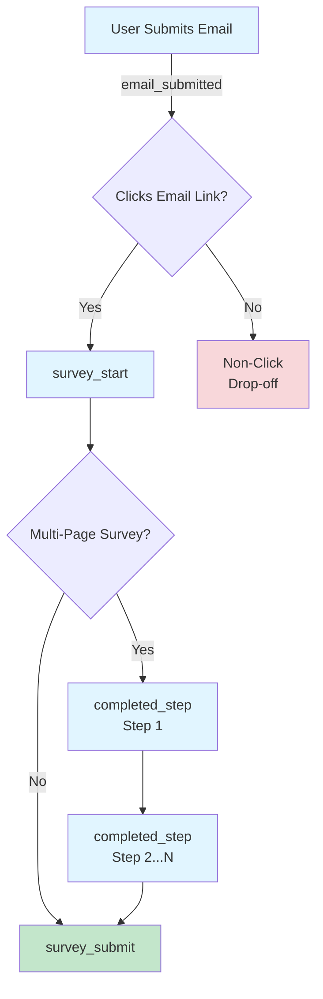
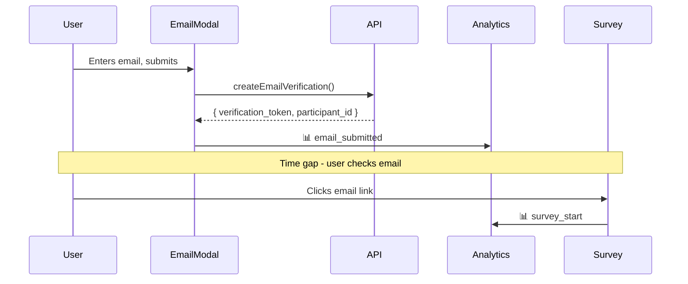

# Analytics Metrics Reference

Implemented metrics for EPIC Engage, tracking the complete user journey from email submission through survey completion.

---

## Implementation Status

Based on `engage_analytics_tracker.csv` requirements:

| Priority | Metric | Status | Notes |
|----------|--------|--------|-------|
| L | Email delivery-to-click conversion | ✅ Implemented | Via `email_submitted` → `survey_start` |
| L | Email open rate | ❌ Not Possible | Requires GC Notify tracking pixel |
| L | Multiple link request correlation | ✅ Implemented | Via `participant_id` |
| H | Landing page visit rate | ✅ Implemented | Conversion tracking |
| H | Survey completion time | ✅ Implemented | `survey_start` → `survey_submit` timestamp diff |
| H | Survey abandonment point | ✅ Implemented | Last `completed_step` before drop-off |
| H | Survey abandonment rate | ✅ Implemented | Start vs submit ratio |
| H | Time on each page | ✅ Implemented | Step timing via `completed_step` |
| H | Click rates on links | ✅ Implemented | `link_click` events |
| L | Scrolling data / heatmap | ❌ Future | Requires additional instrumentation |
| L | Error logging | ✅ Implemented | `error` action |
| H | Referral source tracking | ✅ Implemented | Auto-captured referrer |
| H | Time on engagement page | ✅ Implemented | Page view timing |
| H | Widget usage | ✅ Implemented | `video_play`, `document_open`, `map_click` |
| M | IP geo-location | ✅ Implemented | Server-side GeoIP enrichment |
| H | Survey link CTA click | ✅ Implemented | `cta_click` action |
| H | Results page referral source | ✅ Implemented | Auto-captured referrer |
| H | Time on results page | ✅ Implemented | Page view timing |
| H | Results page visit count | ✅ Implemented | Page view counts |
| H | Survey-to-results conversion | 🔄 Partial | Requires participant correlation |

**Coverage:** ~85% of requirements

---

## Events Summary

| Event | Trigger | File | Key Properties |
|-------|---------|------|----------------|
| `email_submitted` | Email submitted in modal | `EmailModal.tsx` | `verification_token`, `participant_id` |
| `survey_start` | Survey page loaded from email | `SubmitSurveyContext.tsx` | `verification_token`, `participant_id` |
| `completed_step` | User completes survey step | `MultiPageForm.tsx` | `step_number`, `step_name`, `step_count` |
| `survey_submit` | Survey successfully submitted | `SubmitSurveyContext.tsx` | `verification_token`, `participant_id` |

**Correlation Keys:**
- `verification_token` - Links email submission to survey landing (single journey)
- `participant_id` - Identifies repeat users across multiple link requests

---

## Event Flow



---

## Key Metrics

### Landing Page Visit Rate

Tracks email submission through to survey landing page visit.



**Query:**
```sql
WITH journeys AS (
  SELECT 
    properties->>'verification_token' as token,
    BOOL_OR(event_type = 'email_submitted') as email_sent,
    BOOL_OR(event_type = 'survey_start') as landed
  FROM events
  WHERE event_type IN ('email_submitted', 'survey_start')
    AND properties->>'verification_token' IS NOT NULL
  GROUP BY token
)
SELECT 
  COUNT(*) FILTER (WHERE landed) as conversions,
  COUNT(*) as total,
  ROUND(100.0 * COUNT(*) FILTER (WHERE landed) / COUNT(*), 1) as rate
FROM journeys WHERE email_sent;
```

### Email Non-Click Rate

Emails submitted that did NOT result in survey landing.

```sql
SELECT 
  properties->>'verification_token' as token,
  MIN(timestamp) as email_submitted_at,
  EXTRACT(EPOCH FROM (NOW() - MIN(timestamp))) / 3600 as hours_since
FROM events
WHERE event_type IN ('email_submitted', 'survey_start')
  AND properties->>'verification_token' IS NOT NULL
GROUP BY token
HAVING COUNT(CASE WHEN event_type = 'survey_start' THEN 1 END) = 0
ORDER BY email_submitted_at DESC;
```

### Multiple Link Request Correlation

Users who request survey links multiple times and their completion status.

```sql
SELECT 
  properties->>'participant_id' as participant_id,
  COUNT(DISTINCT CASE WHEN event_type = 'email_submitted' 
        THEN properties->>'verification_token' END) as link_requests,
  BOOL_OR(event_type = 'survey_submit') as completed
FROM events
WHERE event_type IN ('email_submitted', 'survey_submit')
  AND properties->>'participant_id' IS NOT NULL
GROUP BY participant_id
HAVING COUNT(DISTINCT CASE WHEN event_type = 'email_submitted' 
              THEN properties->>'verification_token' END) > 1
ORDER BY link_requests DESC;
```

### Survey Step Progression

```sql
WITH funnel AS (
  SELECT 0 as stage, 'Survey Start' as name, COUNT(DISTINCT session_id) as users
  FROM events WHERE event_type = 'survey_start'
  
  UNION ALL
  
  SELECT (properties->>'step_number')::int, properties->>'step_name', COUNT(DISTINCT session_id)
  FROM events WHERE event_type = 'completed_step'
  GROUP BY 1, 2
  
  UNION ALL
  
  SELECT 99, 'Survey Submit', COUNT(DISTINCT session_id)
  FROM events WHERE event_type = 'survey_submit'
)
SELECT * FROM funnel ORDER BY stage;
```

---

## Dashboard Layout

**Dashboard:** EPIC Engage Analytics

### Tabs

| Tab | Cards | Purpose |
|-----|-------|---------|
| Pre-Survey Entry | 8 | Email-to-survey conversion, non-clicks, repeat users |
| Survey Flow | 7 | Step progression, completion times, abandonment |
| Engagement Page | - | (Future) Widget usage, time on page |
| Results | - | (Future) Results page analytics |

### Pre-Survey Entry Tab

| Card | Type | Position |
|------|------|----------|
| Email Non-Click Count | Scalar | Row 0 |
| Email Non-Click Details | Table | Row 0 |
| Landing Page Visit Rate | Smartscalar | Row 12 |
| Visit Rate Over Time | Line | Row 12 |
| Journey Details | Table | Row 19 (full width) |
| Repeat Request Rate | Scalar | Row 32 |
| Link Request Correlation | Bar | Row 32 |
| Repeat Link Requesters | Table | Row 39 (full width) |

### Survey Flow Tab

| Card | Type | Position |
|------|------|----------|
| Survey Completion Rate | Smartscalar | Row 0 |
| Average Completion Time | Smartscalar | Row 0 |
| Time on Each Page - Trend | Line | Row 7 |
| Time on Each Page - Details | Table | Row 7 |
| Survey Step Progression | Funnel | Row 20 |
| Survey Step Completion Rate | Bar | Row 20 |
| Survey Step Details | Table | Row 30 (full width) |

---

## Implementation Files

| Component | Events | Location |
|-----------|--------|----------|
| EmailModal | `email_submitted` | `met-web/src/components/public/engagement/view/EmailModal.tsx` |
| SubmitSurveyContext | `survey_start`, `survey_submit` | `met-web/src/components/public/survey/submit/SubmitSurveyContext.tsx` |
| MultiPageForm | `completed_step` | `met-web/src/components/shared/form/FormBuilder/MultiPageForm.tsx` |
