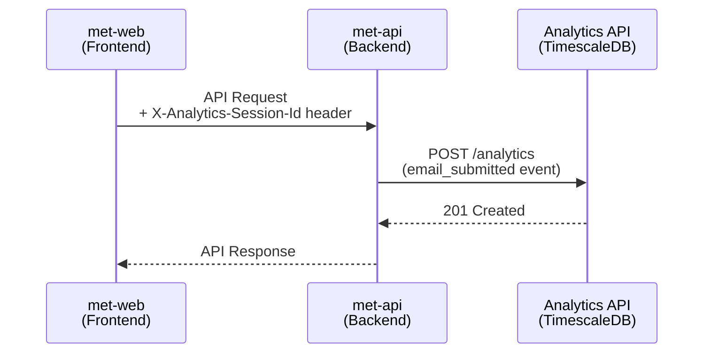
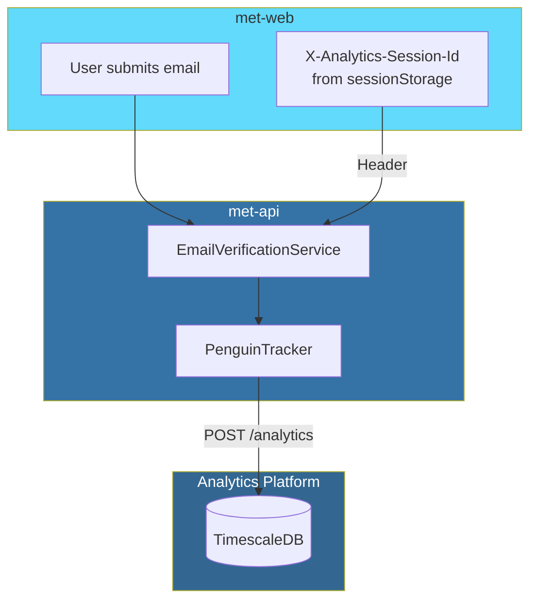

# Server-Side Analytics Integration

Server-side analytics tracking for EPIC Engage. Tracks email verification events with `verification_token` for complete user journey correlation.

---

## Overview

This integration is used alongside the existing Snowplow integration to track EPIC Engage-specific metrics:
- Email-to-survey conversion tracking
- Survey completion time metrics  
- Session continuity between frontend and backend

**Key Benefit:** The `email_submitted` event is tracked **server-side** because it requires access to `verification_token` which is not returned to the frontend for security reasons.

---

## Configuration

Add to `.env`:

```bash
# Enable Penguin Analytics tracking
PENGUIN_ANALYTICS_ENABLED=true

# Penguin Analytics API endpoint
PENGUIN_ANALYTICS_URL=http://localhost:3001/analytics

# Source app identifier for events
PENGUIN_ANALYTICS_SOURCE_APP=met-api
```

### Environment-Specific URLs

| Environment | URL |
|-------------|-----|
| Local | `http://localhost:3001/analytics` |
| Dev | `https://penguin-analytics-api-c72cba-dev.apps.gold.devops.gov.bc.ca/analytics` |
| Test | `https://penguin-analytics-api-c72cba-test.apps.gold.devops.gov.bc.ca/analytics` |
| Prod | `https://penguin-analytics-api-c72cba-prod.apps.gold.devops.gov.bc.ca/analytics` |

---

## Architecture





### Session Continuity

The frontend passes `X-Analytics-Session-Id` header on all API requests. The Penguin tracker extracts this header to maintain session continuity:

```python
# In penguin_tracker.py
ANALYTICS_SESSION_HEADER = 'X-Analytics-Session-Id'

def _get_session_id(self) -> str:
    """Get session ID from request header or generate fallback."""
    try:
        from flask import request, has_request_context
        if has_request_context():
            session_id = request.headers.get(ANALYTICS_SESSION_HEADER)
            if session_id:
                return session_id
    except Exception:
        pass
    return str(uuid.uuid4())
```

---

## Usage

### Email Verification Tracking

The primary use case is tracking `email_submitted` events with `verification_token`:

```python
from met_api.utils.analytics import track_email_verification

# In EmailVerificationService.create()
track_email_verification(
    survey_id=email_verification.get('survey_id'),
    engagement_id=survey.engagement_id,
    verification_type='survey',
    properties={
        'verification_token': str(verification_token),
        'participant_id': email_verification.get('participant_id'),
    }
)
```

### Direct Tracker Access

For custom events, use the tracker directly:

```python
from met_api.utils.penguin_tracker import get_penguin_tracker

tracker = get_penguin_tracker()

# Track custom event
tracker._send_event('custom_event', {
    'custom_property': 'value'
})
```

---

## Events Tracked

| Event | Method | Purpose |
|-------|--------|---------|
| `email_submitted` | `track_email_verification()` | Email verification created with token |
| `survey_submit` | `track_survey_submission()` | Survey completed |
| `error` | `track_error()` | API errors |
| `Page Viewed` | `track_page_view()` | Page views |

### Event Properties

All events include:
- `timestamp` - ISO 8601 timestamp
- `sessionId` - From `X-Analytics-Session-Id` header or generated
- `sourceApp` - From `PENGUIN_ANALYTICS_SOURCE_APP` config

### Correlation Keys

- `verification_token` - Links `email_submitted` → `survey_start` → `survey_submit`
- `participant_id` - Identifies users across multiple link requests
- `session_id` - Groups all events in a browser session

---

## Implementation Files

| File | Purpose |
|------|---------|
| `src/met_api/utils/penguin_tracker.py` | PenguinTracker provider class |
| `src/met_api/utils/analytics.py` | Initializes Penguin alongside Snowplow |
| `src/met_api/services/email_verification_service.py` | Calls `track_email_verification()` |
| `src/met_api/config.py` | Configuration variables |

---

## Testing

### Unit Tests

```bash
# Run Penguin tracker tests (19 tests)
pytest tests/unit/utils/test_penguin_tracker.py -v
```

### Integration Test

```bash
# Start Penguin Analytics locally
cd /path/to/penguin-analytics
docker compose up -d

# Set environment variables
export PENGUIN_ANALYTICS_ENABLED=true
export PENGUIN_ANALYTICS_URL=http://localhost:3001/analytics
export PENGUIN_ANALYTICS_SOURCE_APP=met-api-test

# Run met-api and trigger email verification
```

### Verification Query

```sql
-- Verify email_submitted events with verification_token
SELECT 
  timestamp,
  event_type,
  session_id,
  source_app,
  properties->>'verification_token' as token,
  properties->>'participant_id' as participant_id,
  properties->>'engagement_id' as engagement_id
FROM events 
WHERE event_type = 'email_submitted' 
  AND source_app = 'met-api'
  AND properties->>'verification_token' IS NOT NULL
ORDER BY timestamp DESC 
LIMIT 10;
```

---

## Troubleshooting

### Events Not Appearing

1. Check `PENGUIN_ANALYTICS_ENABLED=true`
2. Verify `PENGUIN_ANALYTICS_URL` is reachable
3. Check API logs for connection errors

### Session ID Missing

1. Verify frontend sends `X-Analytics-Session-Id` header
2. Check `httpRequestHandler/index.ts` includes the header

### Connection Errors

The tracker uses fire-and-forget with 5-second timeout. Failures are logged but don't break the email flow:

```python
# In penguin_tracker.py
response = requests.post(
    self._api_url,
    json=payload,
    headers={'Content-Type': 'application/json'},
    timeout=5
)
```

---

## Related Documentation

- [Analytics Events Reference](../../../docs/Penguin_Analytics_Events.md) - Complete event reference
- [Frontend Analytics Integration](../../../docs/Penguin_Analytics_Integration.md) - Frontend setup guide
